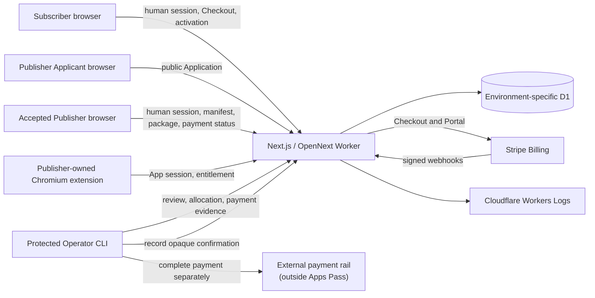
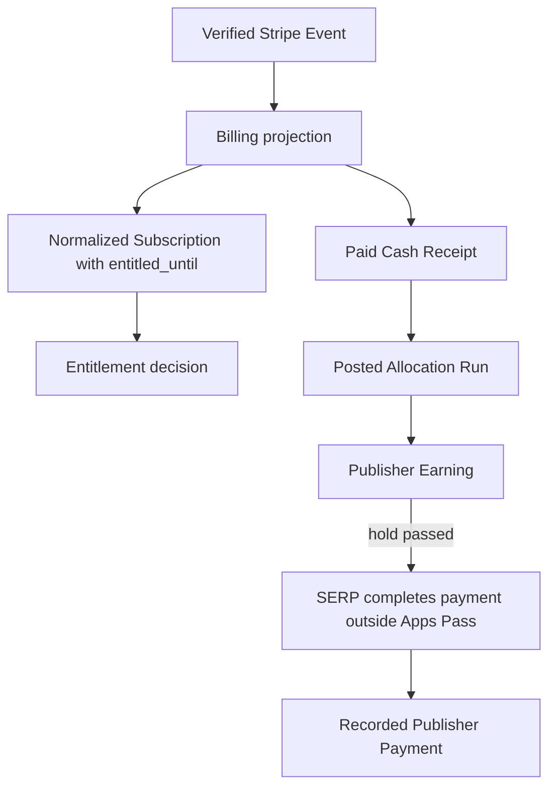
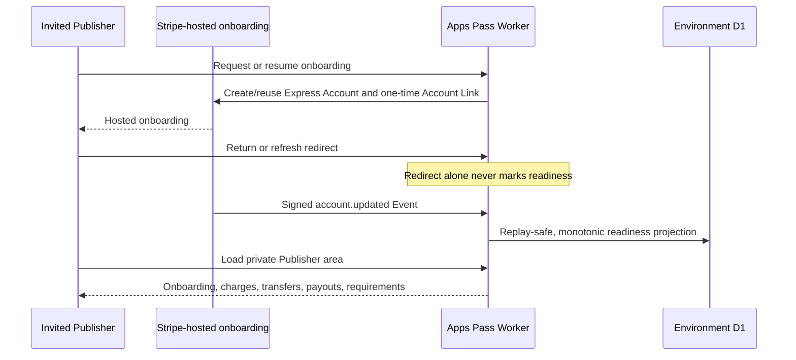
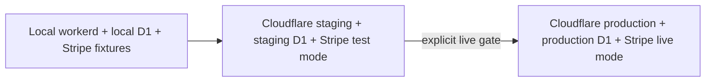

# SERP Apps Pass private-pilot architecture

Status: **target MVP architecture; implementation in progress**

This architecture deliberately keeps one deployable application while separating four trust domains: human identity, App inclusion, Subscriber entitlement, and Publisher money. The interfaces between them are explicit because confusing their states is a financial or access-control bug.

## System map



There is one Worker deployment, not a collection of microservices. Internal modules remain separate because they own different invariants; they do not require separate network services.

## Repository target

```text
apps/
  web/                         Next.js App Router and OpenNext Worker
    app/                       pages and route handlers
    src/
      auth/                    human identity and roles
      apps/                    submissions, approval, distributions
      billing/                 Stripe event projection
      entitlements/            linking, App sessions, decisions
      earnings/                receipts, allocations, ledger, transfers
      operator/                protected use cases
      db/                      D1 client and schema composition

packages/
  app-pass-sdk/                compiled extension-facing client and Entitlement contract
  app-pass-contracts/          versioned App Submission schema and validator

docs/
  mvp/                         binding delivery, money, security, operations
  prototype/                   completed local-proof evidence
  research/                    primary-source platform research
```

Neither package may expose internal database or Stripe types. `app-pass-contracts` owns the public Submission document. `app-pass-sdk` owns the extension-facing Entitlement response and is packed as self-contained JavaScript plus TypeScript declarations.

## Domain state flow



The following are intentionally not synonyms:

- A successful Checkout redirect is not a paid Invoice.
- A paid Invoice is not directly an entitlement decision; it extends normalized paid-through state.
- A Cash Receipt is not a Publisher Earning until an Allocation Run is posted.
- A Publisher Earning is not paid merely because it was allocated.
- A Publisher Payment is evidence recorded after an external payment; recording it does not move money or prove an unobserved bank deposit.

## Deep module interfaces

### App inclusion

Interface:

- submit a public Publisher Application;
- preliminarily accept or decline an Application;
- submit a complete versioned manifest and exact Review Package;
- approve or reject a Submission;
- read the approved App and Distribution identity.

The module hides Application state, whole-document validation, ID assignment rules, private package storage, digest/inspection facts, ownership evidence, conflict detection, compensated cross-store writes, and audit events.

Implemented Slice 3 flow:

```mermaid
sequenceDiagram
    participant A as Publisher Applicant
    participant O as SERP Operator
    participant W as Apps Pass Worker
    participant P as Accepted Publisher
    participant D as Staging D1
    participant E as Publisher extension

    A->>W: Submit public product Application
    W->>D: Store pending Application without authority
    O->>W: Preliminary accept or decline with reason
    W->>D: On acceptance generate IDs, Assignment, and hashed invitation
    P->>W: Accept invitation; submit manifest, evidence, and exact ZIP
    W->>D: Validate contract; store digest and pending Submission
    O->>W: Inspect package and approve or reject with reason
    W->>D: Create approved App and Distribution only on approval
    E->>W: Present App ID and chrome.runtime.id
    W->>D: Read approved canonical identity
    W-->>E: Approved identity or not found
```

The Submission contract lives in `packages/app-pass-contracts`. It contains the JSON Schema, generated Worker-safe validator, canonicalization, and public manifest types. Apps Pass generates Publisher and App IDs only after preliminary Application acceptance; neither human chooses storage identities. The generated App ID configures the extension client. The browser supplies `chrome.runtime.id` at runtime, while `apppass.json` declares the Distribution identity and facts the Operator reviews. One App may later have several Distributions, so an App ID is never derived from a browser runtime ID. None of these public artifacts contains a secret.

Review Package bytes live in a private environment-specific R2 bucket. D1 stores the immutable object key, SHA-256 digest, size, media type, extracted extension-manifest facts, and intake result. The Worker accepts a bounded ZIP, rejects unsafe paths and unsupported manifest shapes, and never executes submitted code. Package storage plus D1 recording is a compensated operation: a failed database write deletes the just-uploaded object. Only an authenticated Operator may retrieve a package for human review.

The monorepo reference extension uses a workspace link for live development. That is not the distribution proof. A separate clean-project check packs the SDK, installs the tarball with npm, imports its compiled module, exercises the public client, and bundles an extension entry without monorepo resolution. The SDK remains non-publishable until the Operator chooses and approves a registry; a pilot Publisher receives the exact tarball and checksum privately.

### Billing projection

Interface:

- ingest one raw, signature-verified Stripe Event;
- return whether it was newly applied, previously applied, or deliberately ignored;
- read normalized Subscription state.

The module hides out-of-order reconciliation, Stripe object mapping, idempotency, and paid-through transitions. Entitlement callers never receive Stripe objects.

### Entitlement authority

Interface:

- begin a proof-bound link;
- approve or deny it as an authenticated Subscriber;
- exchange it once for an App session;
- check access;
- revoke a session or suspend an App.

The module hides proof storage, token hashing, App/Distribution validation, Subscription lookup, and public decision mapping.

Implemented Slice 5 flow:

```mermaid
sequenceDiagram
    participant E as Publisher extension
    participant W as Apps Pass Worker
    participant S as Subscriber browser
    participant D as Environment D1

    E->>W: App ID + runtime ID + installation ID + proof challenge
    W->>D: Verify approved Distribution; store expiring request
    W-->>E: Activation URL
    S->>W: Open URL with Better Auth session
    W-->>S: Canonical Publisher and App identity
    S->>W: Approve or deny
    W->>D: Bind decision to Subscriber
    E->>W: Exchange one-time proof key
    W->>D: Create App Link and hashed, scoped App Session
    E->>W: Check using opaque token + App/runtime claims
    W->>D: Read session, App, Distribution, and paid-through Subscription
    W-->>E: active / inactive / revoked / unauthenticated / temporarily unavailable
```

The extension request must originate from the exact `chrome-extension://<runtime-id>` origin registered in the approved Distribution. The activation page is a human Better Auth surface; its cookies never enter the extension. The App-session token is returned once to the extension and stored only as a SHA-256 hash in D1. A Checkout redirect never affects this decision: only the normalized environment-specific `entitled_until` projection can produce `active`.

### Earnings ledger

Interface:

- record a paid Cash Receipt exactly once;
- post one balanced Allocation Run;
- record one completed external payment for an eligible Publisher Earning;
- read accrued versus paid state without exposing payment credentials.

The module hides immutable ledger entries, balance validation, hold rules, payment-record idempotency, and correction boundaries. Stripe bills Subscribers but does not calculate Publisher earnings or execute Publisher payments in the private pilot.

### Dormant post-MVP Connect experiment

The repository contains a completed local experiment for Stripe Connect onboarding, readiness, Transfers, reversals, and Payout observation. It is preserved as post-MVP evidence, not an active product dependency. Staging does not enable Connect onboarding or Stripe Transfers.



If Connect is reconsidered later, its trust boundary remains valid: a redirect cannot assert readiness, Account Links must not be stored, and only signed Events bound to the created Account may project readiness. Re-enabling it requires a new explicit product and operational decision.

## Request surfaces

The exact route filenames may follow Next.js conventions, but the externally meaningful surfaces are:

- `/`, `/apps`, `/submit`, and `/docs` as public product, catalog, Publisher Application/developer-process, and integration-guide surfaces;
- `/account`, `/publisher/invitation`, `/publisher`, and `/operator` as role-aware human workspaces;
- Better Auth handlers for human sessions;
- `POST /api/billing/checkout`;
- `POST /api/billing/portal`;
- `POST /api/stripe/webhook` using the raw body;
- `POST /api/publisher/submissions`;
- `POST /api/publisher/applications`;
- `POST /api/operator/publisher-applications/:id/review`;
- `GET /api/operator/submissions/:id/package`;
- `POST /api/app-pass/link-requests`;
- `POST /api/app-pass/link-requests/:id/exchange`;
- authenticated `/activate/:id` approval and denial;
- `POST /api/app-pass/entitlements/check`;
- protected Operator use cases exposed primarily through the CLI.
- `POST /api/operator/allocations` and `POST /api/operator/publisher-payments` as protected same-origin Operator use cases.

The Connect webhook, onboarding route, and Stripe settlement route remain dormant post-MVP experiment surfaces and are not enabled by staging configuration.

## Human and App credentials

Human sessions and App sessions are separate credential systems:

| Credential | Represents | Stored by client | Server storage | Used for |
| --- | --- | --- | --- | --- |
| Better Auth session | Human user | Secure browser cookie | Better Auth session record | Subscriber, Publisher, Operator UI |
| App-session token | One linked App installation | `chrome.storage.local` | Hash only | Entitlement checks |
| Stripe secret | SERP platform | Never in browsers/extensions | Cloudflare secret | Server-to-Stripe calls |

No App-session token grants access to human pages, and no human session cookie is embedded in an extension.

## Environments and promotion



- Local, staging, and production use different databases and secrets.
- Stripe test and live identifiers are never stored together.
- Next development-server success is insufficient; every slice must pass OpenNext/workerd preview.
- Staging deployment is required for the exact Better Auth cookie, D1 binding, Stripe webhook, and extension-host-permission composition.
- Production is never an implicit consequence of merging or passing staging tests during the private pilot.

## Prototype reuse boundary

Candidates for deliberate porting:

- manifest schema and importer semantics;
- proof-bound linking;
- opaque, hashed, App-scoped sessions;
- explicit entitlement states;
- generic Chromium SDK interface;
- D1 domain concepts and focused proof scenarios.

Must be replaced rather than relabeled:

- hard-coded Subscriber and active Subscription;
- unauthenticated Operator HTTP routes;
- local approval commands acting as Subscriber UX;
- prototype explanatory Worker page;
- shared example-extension popup shell;
- local fixture identities and local browser lifecycle as product code;
- proof tests presented as production coverage.

## Operational minimum

- Structured events for auth failures, App review, Stripe ingestion, normalized Subscription transitions, link exchange, entitlement errors, Allocation posting, Publisher Payment recording, and reconciliation.
- Stable correlation identifiers without logging tokens, secrets, proof keys, account-link URLs, or payment/identity payloads.
- A protected Operator journey trace follows one Subscriber through Checkout Attempts, provider billing identities, Cash Receipts, App Link Requests, App Sessions, Allocation Runs, Publisher Earnings, and Publisher Payments. The response exposes only operational IDs, state, method, and money amounts; it returns a correlation ID and logs only that ID plus relationship counts.
- D1 migration, Time Travel/recovery, Stripe billing reconciliation, Publisher Payment correction, App suspension, and credential-rotation runbooks.
- Native Cloudflare Workers Logs and modest tracing are sufficient initially. Sentry is not a prerequisite.

See [`docs/mvp/SECURITY.md`](./docs/mvp/SECURITY.md), [`docs/mvp/MONEY_MODEL.md`](./docs/mvp/MONEY_MODEL.md), and [`docs/mvp/DELIVERY_PLAN.md`](./docs/mvp/DELIVERY_PLAN.md).
