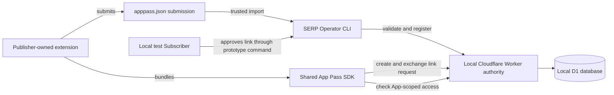
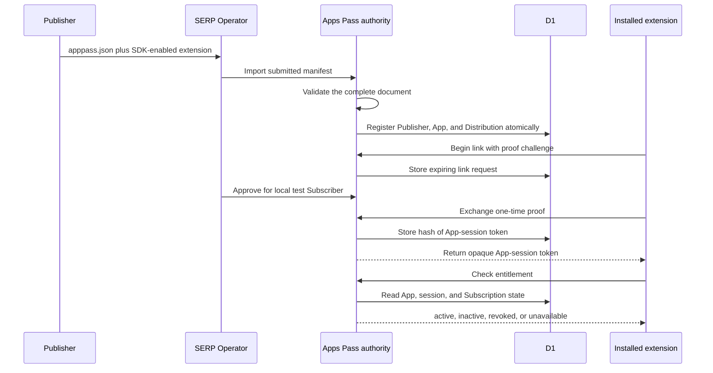

# Architecture of the extension-inclusion proof

Status: **working local prototype; not production architecture**

This repository proves one architectural claim: an extension that the authority did not know about when it was built can register through a versioned manifest, link through a shared SDK, and receive an entitlement from the same Subscription as other extensions.

It does **not** prove checkout, human authentication, Publisher onboarding, payouts, deployment, operational security, or production scale.

## System at a glance

The browser extension never receives a platform secret. It knows only public App and runtime identifiers plus an opaque App-session token issued after linking.

## The working end-to-end path

## Repository map

| Path | Role | Status |
| --- | --- | --- |
| `schemas/` | Versioned `apppass.json` contract | Demonstrated interface; candidate for reuse |
| `src/manifest.ts`, `src/import-app.ts` | Validation and atomic registration | Working proof implementation |
| `packages/app-pass-sdk/` | Extension linking and entitlement interface | Working prototype package; not published or hardened |
| `src/app-pass.ts` | Link, session, revocation, and entitlement behavior | Working proof implementation |
| `src/db/`, `migrations/` | D1/Drizzle persistence model | Working local model; not a production migration history |
| `src/worker.ts` | Composition root, local Operator routes, and explanatory page | Prototype-only Worker; unsafe to deploy unchanged |
| `scripts/operator/` | Trusted local actions replacing real account/admin experiences | Prototype-only adapters |
| `examples/` | Three unpacked Chromium submissions | Disposable examples and proof evidence |
| `prototype/extension-shell/` | Shared popup used to manufacture the example extensions | Demonstration shell, not the integration developers copy wholesale |
| `scripts/proof/`, `tests/*.proof.test.ts` | Executable evidence for the product hypothesis | Proof harness, not a production QA suite |
| `docs/prototype/` | Plan, freeze record, and evaluation | Historical proof evidence |
| `docs/product/` | Earlier launchable-product thinking | Historical and non-binding |

## Demonstrated interfaces

The proof deliberately concentrates behavior behind three small interfaces:

1. **Submission interface:** a Publisher supplies one versioned `apppass.json` document.
2. **Operator import interface:** SERP runs `pnpm operator:import-app <path>`; validation, conflict detection, and D1 writes stay behind that command.
3. **Extension interface:** the extension calls `beginLink()`, `finishLink()`, and `check()` from `@serp-apps-pass/sdk`.

These are the valuable architectural seams. The surrounding local commands and example UI exist to exercise them, not to prescribe the launchable product.

## Prototype substitutions

| Product concern | What the prototype uses | What production still needs to decide |
| --- | --- | --- |
| Subscriber identity | Hard-coded local test Subscriber | Better Auth or another authenticated account system |
| Paid access | Deterministic local active Subscription | Stripe or another provider feeding normalized Subscription state |
| Link approval | Trusted Operator CLI command | Subscriber-facing authenticated approval page |
| Publisher approval | Trusted manifest-import command | Ownership verification, review policy, and possibly a Publisher portal |
| App distribution | Unpacked Chromium extensions | Chrome Web Store identities, release and update workflow |
| Operator security | Unauthenticated localhost routes | Protected administrative interface and authorization policy |
| Runtime | Local Wrangler Worker and local D1 | Cloudflare environments, secrets, migrations, monitoring, and recovery |
| Verification | Focused proof tests and one browser harness | Production threat model, broader tests, deployment checks, and operational validation |

No billing or authentication adapter is modeled yet. Introducing provider interfaces now would be speculative because the production providers and requirements have not been selected.

## What the proof tests mean

The proof tests answer narrow architectural questions:

- Can an unknown manifest be imported without seeded identities?
- Are malformed or conflicting submissions rejected atomically?
- Can separate Apps link through the same SDK and Subscription?
- Are sessions scoped and revocable per App?
- Can a newly discovered extension build, load in Chromium, link, and receive `active`?

They do not claim production coverage, browser-store compatibility, billing correctness, authentication security, uptime, scalability, or operational readiness. See [tests/README.md](./tests/README.md).

## Evidence versus current files

The decisive proof is preserved by Git commits and the recorded migration checksum in [docs/prototype/FREEZE.md](./docs/prototype/FREEZE.md). Later documentation and naming cleanup does not rewrite that evidence. The observed results are recorded in [docs/prototype/EVALUATION.md](./docs/prototype/EVALUATION.md).

## Next architectural decision

The next build should start only after choosing the next question. The smallest likely candidate is: “Can a real existing extension integrate the SDK using a documented developer kit and link through a minimal Subscriber account page?” That decision does not require a marketplace, payouts, or production deployment by default.
