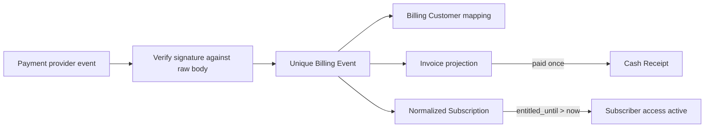

# Subscriber billing projection

Status: **account-independent Slice 4 foundation implemented locally and safely deployed; Stripe adapter and Checkout pending explicit sandbox approval**

## Authority boundary

The Subscriber's browser, a Checkout success redirect, and the extension never declare a Subscription active. The entitlement authority reads only the normalized D1 `entitled_until` value created through the signed billing-event boundary.

The implemented local adapter is intentionally named `/api/billing/test-events`. It:

- exists only when `APP_ENV=local`;
- requires a dedicated local HMAC secret;
- verifies the exact raw body before JSON parsing;
- accepts only normalized `test`-mode fixtures;
- never calls Stripe and must not be relabeled as the Stripe webhook.

The future `/api/stripe/webhook` must independently verify Stripe's `Stripe-Signature` using the sandbox endpoint secret, translate supported Stripe objects into the normalized event contract, derive test/live mode from Stripe rather than request input, and then call the same projection use case.

## Transition rules

| Accepted event | Provider state | Paid-through effect | Invoice/receipt effect |
| --- | --- | --- | --- |
| `invoice.paid` | May advance to `active` only when chronologically newer | `entitled_until = max(existing, paid period end)` | Upsert paid Invoice; create at most one Cash Receipt |
| `invoice.payment_failed` | May advance to `past_due` only when chronologically newer | Never extends or shortens | Record failed Invoice; no Cash Receipt |
| `subscription.updated` | Updates status, cancellation flag, and period only when chronologically newer | Never extends or shortens | None |

Every provider Event ID is unique per provider/mode. Duplicate delivery returns `duplicate` without a second transition. Chronology uses the provider creation time plus Event ID as a deterministic tie-breaker. A delayed older paid Invoice is still recorded, but cannot shorten a later paid-through date or overwrite newer cancellation state.

## Current records

- `billing_customer`: one Subscriber/customer mapping per provider and mode.
- `normalized_subscription`: one current Pass Subscription per Billing Customer during the private pilot.
- `billing_invoice`: provider Invoice state and covered period.
- `billing_event`: payload hash, provider chronology, result, and affected Customer/Subscription/Invoice identities.
- `cash_receipt`: immutable evidence that one paid Invoice supplied one amount/currency for later allocation.

All monetary amounts are integer minor units. Test and live modes are constrained independently and production reads only `live` records.

## Observable local evidence

`pnpm mvp:billing:test` exercises rendered browser and HTTP seams against local workerd/D1. It proves:

- a changed raw body fails signature verification;
- a paid Invoice creates active paid-through access;
- replaying the same Event is a no-op;
- failed renewal does not extend access;
- cancellation retains already paid access;
- delayed older delivery cannot shorten access or overwrite newer status;
- the account page explains the resulting state;
- a Subscriber cannot inspect the Operator audit;
- an Operator sees scoped Event, Invoice, and Cash Receipt counts plus consistency issues.

## Still gated on explicit permission to access the selected Stripe sandbox

The intended isolated Stripe account is `acct_1MwbFJI9EPtyKcIs`, currently named **SERP Pass**. Recording that public account identifier is not permission to access or configure the account. No Stripe credentials or objects are present in the application.

- Stripe SDK and API-version pin;
- Product and recurring Price;
- hosted Checkout and Customer Portal;
- idempotent Checkout creation and Customer reuse;
- real `Stripe-Signature` verification and object translation;
- event-destination/webhook endpoint configuration;
- Stripe-backed reconciliation of missing or delayed Events;
- deployed staging purchase and cancellation/failure scenarios.

No sandbox name, product brand, domain, or Price is encoded in the normalized projection.
