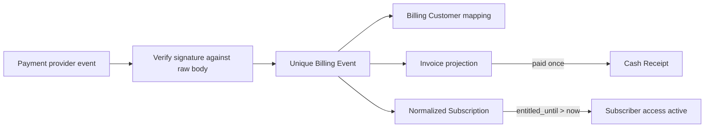

# Subscriber billing projection

Status: **normalized foundation safely deployed; real Stripe adapter and hosted billing routes pass account-independent checks locally; account configuration remains approval-gated**

## Authority boundary

The Subscriber's browser, a Checkout success redirect, and the extension never declare a Subscription active. The entitlement authority reads only the normalized D1 `entitled_until` value created through the signed billing-event boundary.

The implemented local adapter is intentionally named `/api/billing/test-events`. It:

- exists only when `APP_ENV=local`;
- requires a dedicated local HMAC secret;
- verifies the exact raw body before JSON parsing;
- accepts only normalized `test`-mode fixtures;
- never calls Stripe and must not be relabeled as the Stripe webhook.

The real `/api/stripe/webhook` adapter independently verifies Stripe's `Stripe-Signature` against the raw body, translates supported Stripe objects into the normalized event contract, derives test/live mode from Stripe rather than request input, and calls the same projection use case. It uses the pinned official `stripe@22.5.0` SDK and API `2026-07-29.dahlia`, accepts only the configured Pass Price and environment mode, and supports Checkout completion/expiry, paid/failed Invoices, and Subscription creation/update/deletion. Checkout completion closes the durable attempt but never grants access; only a paid Invoice can extend `entitled_until`.

Hosted Checkout and Portal have an additional account-identity gate: they remain unavailable unless an expected platform Account ID is configured, then retrieve the current Stripe Account and stop before mutation when the API credential does not belong to that exact Account. The webhook adapter deliberately does not need this setting, so local signature/Event tests remain account-free.

## Transition rules

| Accepted event | Provider state | Paid-through effect | Invoice/receipt effect |
| --- | --- | --- | --- |
| `invoice.paid` | May advance to `active` only when chronologically newer | `entitled_until = max(existing, paid period end)` | Upsert paid Invoice; create at most one Cash Receipt |
| `invoice.payment_failed` | May advance to `past_due` only when chronologically newer | Never extends or shortens | Record failed Invoice; no Cash Receipt |
| `subscription.updated` | Updates status, cancellation flag, and period only when chronologically newer | Never extends or shortens | None |

Every provider Event ID is unique per provider/mode. Duplicate delivery returns `duplicate` without a second transition. Chronology uses the provider creation time plus Event ID as a deterministic tie-breaker. A delayed older paid Invoice is still recorded, but cannot shorten a later paid-through date or overwrite newer cancellation state.

## Current records

- `billing_customer`: one Subscriber/customer mapping per provider and mode.
- `normalized_subscription`: one current Pass Subscription per Billing Customer during the private pilot.
- `billing_invoice`: provider Invoice state and covered period.
- `billing_event`: payload hash, provider chronology, result, and affected Customer/Subscription/Invoice identities.
- `billing_checkout_attempt`: one durable, idempotent hosted-Checkout attempt with no stored hosted URL.
- `cash_receipt`: immutable evidence that one paid Invoice supplied one amount/currency for later allocation.

All monetary amounts are integer minor units. Test and live modes are constrained independently and production reads only `live` records.

## Observable local evidence

`pnpm mvp:billing:test` exercises rendered browser and HTTP seams against local workerd/D1. It proves:

- a changed raw body fails signature verification;
- a paid Invoice creates active paid-through access;
- replaying the same Event is a no-op;
- failed renewal does not extend access;
- cancellation retains already paid access;
- delayed older delivery cannot shorten access or overwrite newer status;
- the account page explains the resulting state;
- a Subscriber cannot inspect the Operator audit;
- an Operator sees scoped Event, Invoice, and Cash Receipt counts plus consistency issues.

`pnpm mvp:stripe-adapter:test` additionally uses Stripe's official signature generator and current Dahlia Event shapes. Without making a Stripe API request, it proves:

- exact raw-body `Stripe-Signature` verification;
- test/live mode separation;
- configured-Price enforcement;
- Checkout attempt completion without entitlement;
- delayed Checkout expiry cannot overwrite newer completion;
- exact replay is idempotent while changed-payload Event-ID reuse is rejected;
- real Invoice and Subscription shapes enter the same normalized paid-through projection.

## Real sandbox evidence and remaining billing gates

The exact isolated Stripe account `acct_1MwbFJI9EPtyKcIs` (**SERP Pass**) is now configured in test mode under the approved packet. One Product, `$10/month` Price, Portal, and split webhook configuration exist. Real rendered Checkout, duplicate Session reuse, signature-verified Event projection, one Cash Receipt, Event resend/replay, Portal scheduled cancellation, and paid extension entitlement pass on deployed staging.

Still incomplete:

- a real provider-driven failed renewal and natural paid-through expiry;
- refund, dispute, chargeback, and tax operational policy;
- production credentials, live objects, and production deployment;
- allocation and settlement from a successful real test Cash Receipt.

The approved mutations and rollback are in [STRIPE_SANDBOX_APPROVAL.md](./STRIPE_SANDBOX_APPROVAL.md); current IDs and evidence are in [STRIPE_SANDBOX_STATE.md](./STRIPE_SANDBOX_STATE.md).

Official references: [Checkout subscriptions](https://docs.stripe.com/payments/checkout/build-subscriptions), [raw-body webhook signatures](https://docs.stripe.com/webhooks/signature), [idempotent requests](https://docs.stripe.com/api/idempotent_requests), and [Customer Portal](https://docs.stripe.com/customer-management/integrate-customer-portal).

No sandbox name, product brand, domain, or Price is encoded in the normalized projection.
