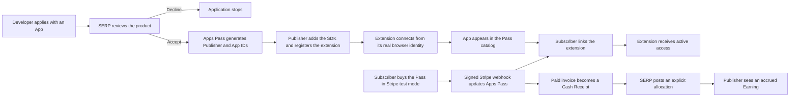

# Human staging evaluation guide

Use this guide to understand and evaluate the completed SERP Apps Pass staging MVP without reading the implementation first.

**Staging site:** [serp-apps-pass-staging.serpcompany.workers.dev](https://serp-apps-pass-staging.serpcompany.workers.dev)

**Expected time:** 20–40 minutes for the product walkthrough, plus optional Stripe test Checkout.

**Money boundary:** Stripe is in test mode. No live charge or real Publisher payment occurs. The final staging result is an accrued Publisher Earning—not money sent to a Publisher.

## What you are evaluating

The MVP should make this story believable and observable:

There are three distinct human roles:

| Role | What that person does |
| --- | --- |
| Developer / Publisher | Applies, receives generated IDs after acceptance, adds the SDK, and connects the extension. |
| SERP Operator | Decides whether the product belongs in the Pass and later posts the explicit revenue allocation. |
| Subscriber | Buys the Pass, approves an extension link, and receives access while paid through. |

The Developer cannot approve their own Application. The Checkout return page cannot activate a Subscription. The extension cannot grant itself access.

## Recommended way to run it tomorrow

Open a fresh Codex task in this repository and paste the prompt from [`docs/walkthroughs/JOHN_DOE_FRESH_AGENT_PROMPT.md`](../walkthroughs/JOHN_DOE_FRESH_AGENT_PROMPT.md).

The agent plays **John Doe**, the example external developer. You remain the **SERP Operator** and, optionally, the **Subscriber**. The agent performs developer-side setup and objective checks, but it must stop for your actual product decision and before test Checkout.

Staging already contains a completed John Doe run. The agent must inspect that state first. If the fixed John Doe App and runtime are already connected, it should walk you through the existing evidence instead of creating duplicate Applications or claiming a second extension identity. This is expected, not a test failure.

Do not paste passwords, invitation codes, App-session tokens, Stripe keys, or other secrets into the repository or an issue. A one-time invitation code may be passed transiently to the walkthrough agent when the agent explicitly asks for it.

## Walkthrough

### 1. Understand the public product

Open these pages:

1. [Home](https://serp-apps-pass-staging.serpcompany.workers.dev/) — explains the one-subscription bundle.
2. [Apps](https://serp-apps-pass-staging.serpcompany.workers.dev/apps) — lists Apps that are accepted and connected.
3. [Submit an App](https://serp-apps-pass-staging.serpcompany.workers.dev/submit) — begins the developer-initiated Application.
4. [Developer docs](https://serp-apps-pass-staging.serpcompany.workers.dev/docs) — explains the SDK, generated IDs, manifest, and connection.

Pass if you can explain, without repository knowledge, what a Subscriber receives and how a developer asks to participate. Record confusing wording instead of guessing what it means.

### 2. Observe the developer Application boundary

On **Submit an App**, inspect the information requested from a developer:

- developer and company contact;
- proposed extension and public review location;
- product/catalog case;
- permissions and privacy explanation;
- ownership statement.

Submitting this form should create only a pending **Publisher Application**. It must not create a Publisher login, catalog listing, App authority, or entitlement.

If the guided agent submits a fresh Application, wait for it to say that the Application is pending before continuing.

### 3. Make the one admission decision

Sign in with your existing staging Operator account at [Account](https://serp-apps-pass-staging.serpcompany.workers.dev/account), then open [Operator controls](https://serp-apps-pass-staging.serpcompany.workers.dev/operator).

For a fresh Application:

1. Expand **Inspect the Publisher Application**.
2. Read the listing/source, product case, permissions/privacy, and ownership statement.
3. Enter a meaningful review reason.
4. Choose **Accept for technical onboarding** or **Decline Application**.

This is a real product-admission decision in staging, not approval of boilerplate text. Declining is a valid outcome. Accepting generates immutable public Publisher/App IDs and a one-time, email-bound invitation. It is not a source-code or security certification.

If John Doe is already accepted and connected, inspect that existing identity and let the agent verify it. Do not create a duplicate merely to repeat the click.

### 4. Observe Publisher onboarding and connection

After acceptance, the developer-side sequence is:

1. Sign in using the same accepted email and redeem the one-time invitation.
2. Copy the Apps Pass-generated `publisher_id` and `app_id` into `apppass.json`.
3. Configure the SDK with the generated App ID and rebuild or publish the extension.
4. Register the public manifest, version, and Chromium Distribution identity.
5. Open the actual extension so the SDK calls `verifyConnection()` from `chrome.runtime.id`.

The agent should perform or verify these developer steps. Your job is to confirm that the Publisher and Operator views say **Connected**, and that [Apps](https://serp-apps-pass-staging.serpcompany.workers.dev/apps) contains **John Doe Focus Timer**.

Connection proves that the accepted App ID and the installed browser-extension identity communicated correctly. It does **not** claim that SERP reviewed the source, certified the extension as safe, or verified every premium feature.

### 5. Observe the Subscriber boundary

Open [Account](https://serp-apps-pass-staging.serpcompany.workers.dev/account) in a separate Subscriber session. The existing staging evidence may be inspected without making another test purchase.

If you deliberately choose to repeat Checkout:

1. Confirm with the agent that it has verified Stripe **test mode** and account `acct_1MwbFJI9EPtyKcIs`.
2. Click the test Checkout button.
3. Complete only Stripe's documented test-card flow—never enter a real card.
4. Return to Account and wait for the normalized Subscription state.

The redirect itself must not grant access. A signature-verified Stripe webhook must update D1 first. The account should show the authoritative Subscription status and paid-through time.

### 6. Link the extension and check access

The guided agent can prepare the John Doe extension activation. You should:

1. Open the activation URL while signed in as the Subscriber.
2. Confirm the page identifies **John Doe Focus Timer** and **John Doe Studio**.
3. Approve the link.
4. Tell the agent `done` so it can finish the one-time exchange and check access.

Pass if the already-paid Subscriber receives `active`. An unpaid or expired Subscriber should receive `inactive`. Revoked/suspended access and authority outages must be distinguishable from ordinary inactivity.

### 7. Understand the money result

A successfully paid Stripe test Invoice becomes exactly one **Cash Receipt**. SERP then posts an explicit, balanced Allocation; the MVP does not secretly invent a revenue-share formula.

The completed John Doe evidence allocates a $10 test receipt as:

- $7 Publisher Earning;
- $2 SERP platform amount;
- $1 reserve.

Pass if the Publisher can see a **$7 accrued Earning awaiting payment** and the system does not claim it was paid. Sending actual money to a Publisher is deliberately deferred to the controlled live-pilot phase.

## Evaluation scorecard

Mark each row `PASS`, `FAIL`, or `UNCLEAR`.

| Check | Expected result | Result / notes |
| --- | --- | --- |
| Public explanation | You understand the Pass and its audience. | |
| Developer Application | Applying creates a pending request only. | |
| SERP product decision | Only the Operator can accept or decline with a reason. | |
| Generated identities | Apps Pass—not the applicant—creates Publisher/App IDs. | |
| Extension connection | The real App/runtime pair becomes Connected. | |
| Catalog | Only accepted, connected Apps are visible/eligible. | |
| Subscriber billing | Stripe test Checkout projects through a signed webhook. | |
| App linking | The Subscriber sees and approves the exact App identity. | |
| Entitlement | Paid access is active; unpaid/expired access is inactive. | |
| Earnings | One paid receipt can become one balanced accrued Earning. | |
| Payment honesty | Staging never claims the Publisher was actually paid. | |
| Overall usability | You can explain the flow without reading source code. | |

The MVP is confirmed if the functional rows pass and the remaining concerns are understandable UX/policy improvements rather than contradictions in authority, billing, entitlement, or money state.

## What to report if something is wrong

Capture:

- the walkthrough step;
- the page URL and visible state;
- what you expected;
- what happened instead;
- a screenshot when helpful;
- whether you were acting as Developer, Operator, or Subscriber.

Do not include passwords, invitation codes, cookies, tokens, Stripe keys, full webhook bodies, or real payment information.

## What this staging MVP does not prove

- production or public-launch readiness;
- live Stripe charges or a real Publisher settlement;
- email ownership verification or password recovery;
- legal, tax, refund, dispute, and support operations;
- an independent external Publisher's opinion of the SDK handoff;
- source-code safety review or enforcement inside arbitrary Publisher code.

Those belong to a separately approved production-readiness and controlled live-pilot phase.
