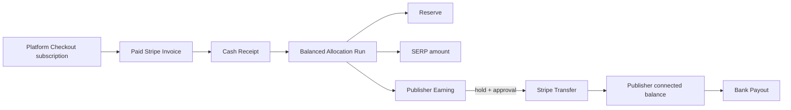

# Private-pilot money model

Status: **binding test-mode model; live policy approval still required**

## Principle

Stripe is the payment and money-movement provider. Apps Pass remains authoritative for why a Publisher is owed an amount.

The MVP must never calculate a Publisher balance by summing Stripe Transfers alone. Transfers can fail, be reversed, or be paid out separately; they are settlement evidence, not the earnings ledger.

## Money flow



## Ledger invariants

All amounts use integer minor currency units and an explicit ISO currency.

1. A Stripe Invoice can create at most one Cash Receipt per environment/mode.
2. Refunds, disputes, reversals, and corrections are new signed ledger entries; no posted entry is overwritten or deleted.
3. Every Allocation Run balances exactly:

   ```text
   distributable amount = reserve + SERP amount + sum(Publisher Earnings)
   ```

4. The total distributable amount cannot exceed the unallocated eligible Cash Receipts included in the run.
5. A Publisher Earning references exactly one Publisher, one Allocation Run, one amount, one currency, and one `available_at` time.
6. A Publisher Earning cannot be released twice.
7. Every Stripe Transfer uses a deterministic idempotency key derived from the environment and settlement identity.
8. Test-mode and live-mode money never share a ledger or Stripe object namespace.
9. A Transfer does not mark a bank Payout complete.
10. Operator identity, timestamp, reason, and supporting references accompany every posted Allocation, release, reversal, and correction.

## Private-pilot allocation policy

The application does not automate a usage or equal-share formula.

For each pilot Allocation Run, the Operator explicitly enters:

- included Cash Receipts;
- amount held as reserve;
- amount retained by SERP;
- amount attributed to each Publisher;
- reason and agreement reference;
- hold/release date.

The system validates that the run balances and then posts immutable ledger entries. This supports a real invited-Publisher payment without pretending that product economics have already been discovered.

## Test-mode release policy

- A zero-day hold is allowed only in Stripe test mode so the complete flow can be exercised.
- Connect onboarding/readiness must be confirmed from Stripe state, not a return redirect.
- Transfer creation is Operator-triggered and idempotent.
- Test failure, retry, and reversal paths must be recorded.

## Live policy gate

Before any live allocation or Transfer, document and approve:

- seller/merchant and tax responsibility;
- definition of distributable receipts;
- treatment of tax, discounts, Stripe fees, refunds, disputes, reserves, and platform margin;
- Publisher formula or agreed fixed amount;
- hold length, payout cadence, minimum, and currency;
- negative-balance and failed-recovery responsibility;
- Publisher country eligibility and cross-border constraints;
- correction, dispute, and agreement-termination process.

These are commercial decisions. Environment variables or undocumented Operator habits are not acceptable substitutes.

## Minimum records

- `cash_receipts`
- `ledger_entries`
- `allocation_runs`
- `publisher_earnings`
- `settlements`
- `stripe_transfers`
- `stripe_transfer_reversals`
- `connected_account_payouts`
- `operator_audit_events`

Exact tables may be deepened during schema design, but the observable concepts and invariants must remain.
