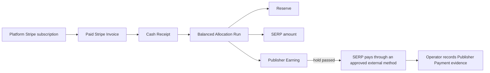

# Private-pilot money model

Status: **binding private-pilot model; live policy approval still required**

## Principle

Stripe bills Subscribers for a platform-owned Pass subscription. Apps Pass remains authoritative for why a Publisher is owed an amount. SERP completes Publisher payments outside Apps Pass during the private pilot.

A Publisher Payment record is evidence created after SERP completes an external payment. Creating the record never moves money and never proves an unobserved bank deposit. Apps Pass stores no bank account, payment-account credential, tax identifier, or Publisher email address as a payment reference.

## Money flow



## Ledger invariants

All amounts use integer minor currency units and an explicit ISO currency.

1. A Stripe Invoice can create at most one Cash Receipt per environment/mode.
2. Refunds, disputes, payment reversals, and corrections require new evidence or compensating entries; posted financial evidence is never overwritten or deleted.
3. Every Allocation Run balances exactly:

   ```text
   distributable amount = reserve + SERP amount + sum(Publisher Earnings)
   ```

4. The total distributable amount cannot exceed the unallocated eligible Cash Receipts included in the run.
5. A Publisher Earning references exactly one Publisher, one Allocation Run, one amount, one currency, and one `available_at` time.
6. One Publisher Earning can have at most one Publisher Payment.
7. A Publisher Payment must match the Earning's Publisher, amount, currency, environment mode, and hold time exactly.
8. Payment ID and method/provider reference are unique. Exact replay is a no-op; conflicting reuse rejects.
9. Payment evidence records Operator identity, completion time, reason, method, and an opaque provider confirmation reference.
10. No Publisher may mark their own Earning paid, and no payment credentials may enter Apps Pass.

## Private-pilot allocation policy

The application does not automate a usage or equal-share formula. For each pilot Allocation Run, the Operator explicitly enters:

- included Cash Receipts;
- amount held as reserve;
- amount retained by SERP;
- amount attributed to each Publisher;
- reason and agreement reference;
- hold/payment-eligible date.

The system validates that the run balances and then posts immutable ledger entries. This supports a real invited-Publisher payment without pretending product economics have already been discovered.

## Private-pilot payment policy

1. SERP and the Publisher agree on a payment method outside Apps Pass.
2. SERP completes payment outside Apps Pass.
3. An Operator records the completed payment against the exact eligible Earning.
4. The record contains only the approved method and opaque confirmation reference—not an account number, routing number, email address, access token, or tax identifier.
5. The Publisher page distinguishes **accrued** from **paid externally**.
6. Minimum threshold, cadence, and supported methods remain explicit commercial policy; the application does not invent them.

## Live policy gate

Before any live Allocation or Publisher Payment, document and approve:

- seller/merchant and customer-tax responsibility;
- definition of distributable receipts;
- treatment of tax, discounts, Stripe fees, refunds, disputes, reserves, and platform margin;
- Publisher formula or agreed fixed amount;
- hold length, payment cadence, minimum, currency, and supported methods;
- Publisher tax-information collection and reporting process;
- negative-balance and failed-recovery responsibility;
- supported Publisher countries and cross-border payment constraints;
- correction, dispute, duplicate-payment, and agreement-termination process.

These are commercial and legal/accounting decisions. Environment variables or undocumented Operator habits are not acceptable substitutes.

## Minimum records

- `cash_receipt`
- `ledger_entry`
- `allocation_run`
- `publisher_earning`
- `publisher_payment`
- `operator_audit_event`

## Implemented boundary

Migrations `0017_earnings_allocation_ledger.sql` and `0018_close_posted_allocation_append.sql` implement immutable balanced Allocation and Earning state. Migration `0025_external_publisher_payment.sql` adds provider-neutral, immutable completed-payment evidence.

`POST /api/operator/allocations` posts one explicit Allocation Run. `POST /api/operator/publisher-payments` records a payment already completed elsewhere. Both require a same-origin authenticated Operator, canonical request hashing, exact replay behavior, and append-only audit evidence.

D1 triggers enforce receipt capacity and currency, validate the final zero-sum ledger, prevent mutation of posted financial state, and independently validate that a Publisher Payment exactly matches an eligible Earning. The Publisher view exposes method, opaque confirmation reference, and paid time without exposing Operator reasoning or payment credentials.

The Connect, Transfer, reversal, and connected-account Payout tables/routes from migrations `0016` and `0019`–`0024` are preserved as dormant post-MVP experiment evidence. Staging does not enable Connect onboarding or Stripe Transfer execution, and the active private-pilot workflow does not depend on those records.
