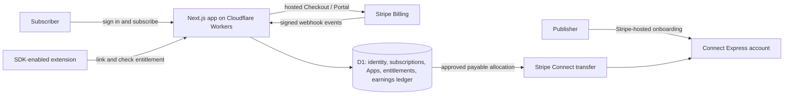

# Minimal trustworthy MVP platform research

Status: **primary-source research; not an implementation plan or production approval**
Date: **2026-08-13**

## Question

What is the smallest credible platform architecture that can move the current local extension-inclusion proof into a hosted MVP where a Subscriber can pay, use a participating extension, and create earnings that can later be paid to a Publisher?

## Recommended minimal vertical slice

Use one platform-owned subscription, one entitlement authority, and an Apps Pass-owned earnings ledger. Stripe hosts checkout, customer billing management, Publisher onboarding, and money movement. It does **not** define how bundle revenue is allocated.

## Verified facts and architectural implications

### 1. Subscriber billing and entitlement state

**Verified facts**

- Stripe Checkout supports recurring subscriptions with `mode=subscription`. Stripe's subscription guide identifies `checkout.session.completed`, `invoice.paid`, and `invoice.payment_failed` as important lifecycle events and recommends the Customer Portal for Subscriber billing management. [Stripe: build subscriptions with Checkout](https://docs.stripe.com/payments/checkout/build-subscriptions)
- Stripe's webhook guidance requires signature verification using the raw request body and `Stripe-Signature`. Event delivery can be retried, duplicated, and out of order, so webhook consumers must not assume a single ordered delivery. [Stripe: webhooks](https://docs.stripe.com/webhooks)
- Stripe describes `invoice.paid` as a point at which access can be provisioned when the subscription is active. Subscription status changes must be reconciled through webhooks; the treatment of statuses such as `past_due` remains a product policy. [Stripe Billing: subscription webhooks](https://docs.stripe.com/billing/subscriptions/webhooks)

**Architectural implications**

- The browser redirect after Checkout is confirmation UX, not billing authority.
- Store Stripe Customer, Subscription, Invoice, and Event identifiers in D1. Process webhook events idempotently and project them into the normalized Apps Pass Subscription state used by the existing entitlement boundary.
- Define explicit states and transitions rather than checking Stripe on every extension request. At minimum, distinguish active access, inactive access, grace/past-due policy, canceled/expired, and temporarily unavailable.

### 2. Publisher onboarding and payout rails

**Verified facts**

- Stripe-hosted Connect onboarding collects identity and verification information for connected accounts. Account Links are single-use; `return_url` means the user returned, not that onboarding is complete. Stripe directs platforms to inspect account requirements and capability/readiness state. [Stripe: hosted onboarding](https://docs.stripe.com/connect/hosted-onboarding), [Stripe: handle verification](https://docs.stripe.com/connect/handling-api-verification)
- Express/Express Dashboard connected accounts minimize platform-built onboarding and account-management UI. Stripe notes that the account dashboard choice cannot be changed after account creation. [Stripe: connected accounts](https://docs.stripe.com/connect/accounts)
- Connected-account payout events are separate from platform transfers; payout failures can require the Publisher to update external account details. [Stripe: connected-account payouts](https://docs.stripe.com/connect/payouts-connected-accounts)

**Architectural implications**

- The minimal Publisher area needs only: authenticated onboarding launch, onboarding/readiness status, submitted App status, accrued earnings, and transfer/payout history. It does not need a general marketplace dashboard.
- Never infer onboarding completion from a redirect. Store the connected-account ID and update readiness from Stripe account state/events.
- Keep three states distinct: earned in the Apps Pass ledger, transferred to the connected account, and paid out by Stripe to the Publisher's bank.

### 3. Correct Connect money flow for one bundle and multiple Publishers

**Verified facts**

- Stripe explicitly documents platform subscriptions whose funds arrive at the platform and are later transferred to connected accounts. [Stripe Connect: subscriptions for platform end customers](https://docs.stripe.com/connect/subscriptions#subscriptions-for-platform-end-customers)
- Separate charges and transfers allow one platform charge to be split across multiple connected accounts, transfers to be delayed, and multiple charges to be aggregated into transfers. The platform determines transfer amounts. [Stripe Connect: separate charges and transfers](https://docs.stripe.com/connect/separate-charges-and-transfers), [Stripe Connect: charge types](https://docs.stripe.com/connect/charges)
- Under this model, the platform is normally responsible for Stripe fees and its balance is exposed to refunds, disputes, and chargeback fees. Transfer reversals may be attempted, but recovery can fail when the connected account lacks funds. [Stripe Connect: refunds](https://docs.stripe.com/connect/charges#refunds), [Stripe Connect: disputes](https://docs.stripe.com/connect/disputes)
- Cross-region transfers are restricted, and Connect pricing varies by platform country and pricing model. [Stripe Connect: separate charges and transfers](https://docs.stripe.com/connect/separate-charges-and-transfers), [Stripe Connect pricing for Japan](https://stripe.com/en-jp/connect/pricing)

**Architectural implications**

- Use a normal platform-owned Stripe subscription plus **separate charges and transfers**, not a destination charge tied to one Publisher.
- Apps Pass must own an immutable, auditable earnings ledger: paid invoice -> distributable pool -> Publisher allocations -> hold/reserve -> transfer attempt -> transfer/reversal outcome. Record Stripe IDs and use idempotency keys.
- Do not transfer funds immediately. A release hold and payout cadence are needed so refunds and disputes can be absorbed before money leaves the platform.
- Prove this in Stripe test mode first. A real live payment and real Publisher payout require a separately approved live-mode/KYC/commercial-compliance step.

### 4. Cloudflare application and database path

**Verified facts**

- Cloudflare's current full-stack Next.js path is deployment to **Cloudflare Workers** with the OpenNext adapter. App Router, route handlers, React Server Components, SSR, SSG, Server Actions, and streaming are supported; Node.js middleware is not yet supported. [Cloudflare Workers: Next.js](https://developers.cloudflare.com/workers/framework-guides/web-apps/nextjs/)
- Cloudflare distinguishes the Node.js-backed Next development server from the production-like adapter preview. It recommends the preview command for integration testing because it runs under `workerd` through Wrangler. [Cloudflare Workers: Next.js development and preview](https://developers.cloudflare.com/workers/framework-guides/web-apps/nextjs/)
- D1 supports separate Wrangler environments and separate databases for staging and production. Local Wrangler D1 state is isolated from remote production data by default. [Cloudflare D1: environments](https://developers.cloudflare.com/d1/configuration/environments/), [Cloudflare D1: local development](https://developers.cloudflare.com/d1/best-practices/local-development/)
- D1's migration system records applied SQL migrations; `wrangler d1 migrations apply` can target local, remote, preview, and named environments. Failed migrations are rolled back while earlier successful migrations remain. D1 documents support for Drizzle's nested migration layout through `migrations_pattern`. [Cloudflare D1: migrations](https://developers.cloudflare.com/d1/reference/migrations/), [Cloudflare D1: Wrangler commands](https://developers.cloudflare.com/d1/wrangler-commands/)
- Drizzle officially documents D1 runtime/schema workflows and Drizzle Kit access to D1. [Drizzle: D1 existing project](https://orm.drizzle.team/docs/get-started/d1-existing), [Drizzle Kit: D1 HTTP API](https://orm.drizzle.team/docs/guides/d1-http-with-drizzle-kit)
- D1 Time Travel provides point-in-time recovery; retention depends on the Workers plan. [Cloudflare D1: Time Travel and backups](https://developers.cloudflare.com/d1/reference/time-travel/)

**Architectural implications**

- Prefer one deployable Next.js/OpenNext Worker for the MVP UI, auth endpoints, Stripe webhooks, Publisher onboarding endpoints, and entitlement authority. Splitting into microservices adds no necessary confidence yet.
- Maintain physically separate local, staging, and production D1 databases. Never point ordinary development at production data.
- Keep reviewed SQL migrations in Git and apply them explicitly per environment. Treat application rollback and database rollback as different operations because Worker versions do not version D1 state.
- The production-like gate is: tests -> local `workerd` preview -> deployed staging with staging D1 and Stripe test mode -> explicitly approved production deployment.

### 5. Minimum native observability

**Verified facts**

- Workers Logs captures invocation logs, custom logs, errors, and uncaught exceptions and makes them queryable in Cloudflare. Observability can be configured per environment with sampling. [Cloudflare: Workers Logs](https://developers.cloudflare.com/workers/observability/logs/workers-logs/)
- Cloudflare's Worker best practices say to enable logs and traces before production and recommend structured JSON logs with appropriate `console.error`/`console.warn` severity. [Cloudflare: Workers best practices](https://developers.cloudflare.com/workers/best-practices/workers-best-practices/)
- Workers tracing provides automatic spans for Worker invocations, outbound fetches, and binding calls when enabled. [Cloudflare: Workers traces](https://developers.cloudflare.com/workers/observability/traces/)

**Architectural implications**

- The MVP does not need Sentry as a launch prerequisite. Enable Cloudflare Workers Logs, structured event/error logging, and a modest trace sampling rate.
- Log identifiers and state transitions for billing events, entitlement decisions, App imports, link exchanges, earnings allocations, transfers, and failures. Never log session tokens, webhook secrets, account-link URLs, or sensitive identity data.
- Add external error reporting later only if native retention, alerting, or debugging proves inadequate. Basic observability is configuration plus disciplined structured events, not a separate SRE project.

### 6. Better Auth on Workers/D1

**Verified facts**

- Better Auth documents Next.js route handlers and a Drizzle adapter with SQLite as a supported provider. [Better Auth: Next.js integration](https://better-auth.com/docs/integrations/next), [Better Auth: Drizzle adapter](https://better-auth.com/docs/adapters/drizzle)
- Better Auth 1.5 introduced first-class Cloudflare D1 support: a Worker can pass its D1 binding directly, with D1 `batch()` used where interactive transactions are unavailable. [Better Auth 1.5: Cloudflare D1 support](https://better-auth.com/blog/1-5), [Better Auth: database](https://better-auth.com/docs/concepts/database)

**Architectural implications**

- Better Auth is a supported candidate for Subscriber and Publisher human sessions on this stack.
- Keep human browser sessions separate from the existing App-scoped extension sessions. They have different trust, revocation, and storage requirements.
- Before implementation, make one small deployed-staging spike prove the exact combination of pinned Better Auth version, Next.js/OpenNext, D1 binding, chosen sign-in method, cookie settings, and schema migration workflow. Do not infer that generic support guarantees this exact composition.

## Proposed MVP boundary

The smallest credible release should demonstrate:

1. A Subscriber signs in and completes Stripe test-mode Checkout.
2. Verified, idempotent Stripe webhooks create/update the normalized Subscription in D1.
3. A real SDK-integrated Chromium extension links through an authenticated Subscriber approval screen and receives `active`.
4. Cancellation or the selected delinquency policy removes access through the same webhook projection.
5. An authenticated Publisher submits the standard manifest, completes Stripe-hosted Connect onboarding, and has one App approved by the Operator.
6. A paid invoice creates auditable Publisher earnings under a deliberately simple allocation rule.
7. After a hold/review step, a Stripe test-mode transfer is created for the Publisher's connected account and its outcome is recorded.
8. The complete path runs on deployed Cloudflare staging with a separate staging D1 database, structured logs, and no production credentials.

Only after that passes should a separately approved live-mode smoke transaction be considered. “Live Subscriber payment” and “Publisher can receive money” are distinct release gates.

## Unresolved product decisions

These are requirements, not implementation details, and must be decided before calling the MVP trustworthy:

1. Is SERP the seller/merchant to the Subscriber, and who owns taxes, invoices, refunds, chargebacks, and customer support?
2. What is the Publisher allocation rule: equal, fixed weight, usage-based, or another formula?
3. What is the distributable basis: gross cash less which taxes, discounts, Stripe fees, refunds, disputes, reserves, and platform margin?
4. When are earnings final, how long is the hold, what is the payout cadence/minimum, and who bears unrecoverable negative balances?
5. Which Publisher countries and currencies are supported at launch?
6. Does `past_due` retain access for a grace period, and exactly which Stripe states grant or revoke entitlement?
7. What evidence establishes that a Publisher owns or is authorized to submit an extension?
8. Which initial sign-in method and email delivery provider will be used? Better Auth compatibility is verified; email deliverability and recovery policy are not selected.
9. Is Publisher self-service submission truly required for the first MVP, or may an Operator import the first invited Publisher's manifest while the Publisher independently completes documentation and Connect onboarding?

## Decision summary

The stack can support a minimal trustworthy MVP without a marketplace catalog, payout engine vendor, Sentry, or multiple backend services. The critical additions are real human authentication, Stripe webhook-derived subscription state, an authenticated link-approval experience, hosted Connect onboarding, a first-class earnings ledger, environment isolation, and a deployed staging proof. The revenue-share policy and merchant/compliance responsibilities must be decided explicitly; coding around those unknowns would create the exact disposable slop this phase is intended to avoid.
